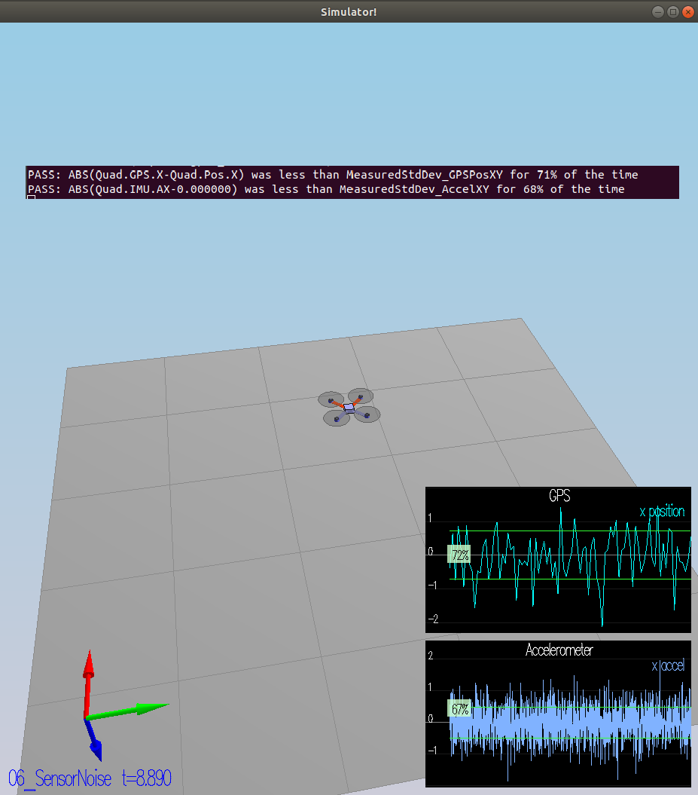
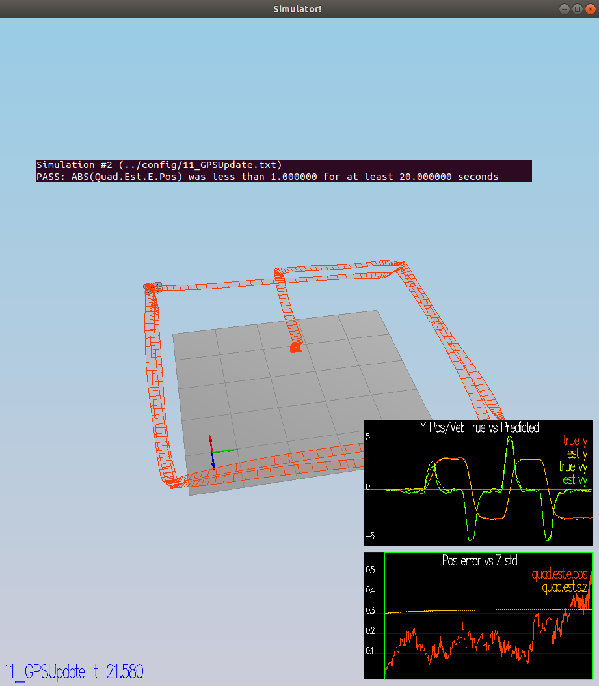
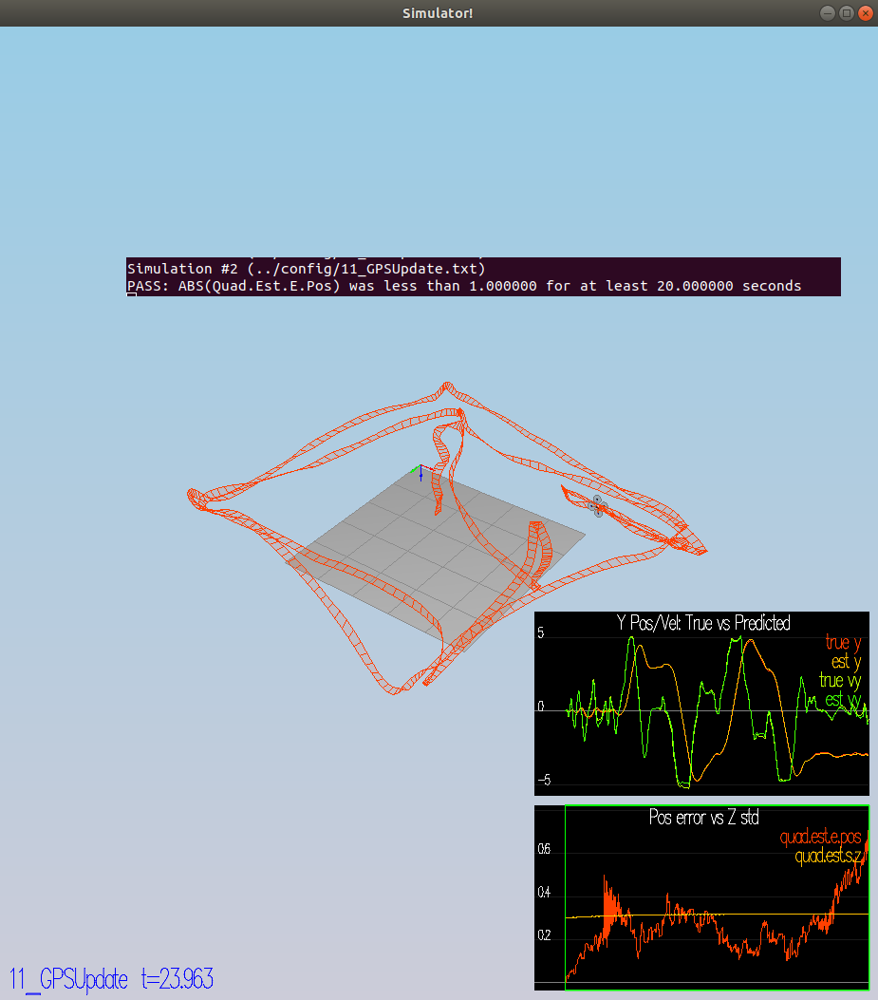
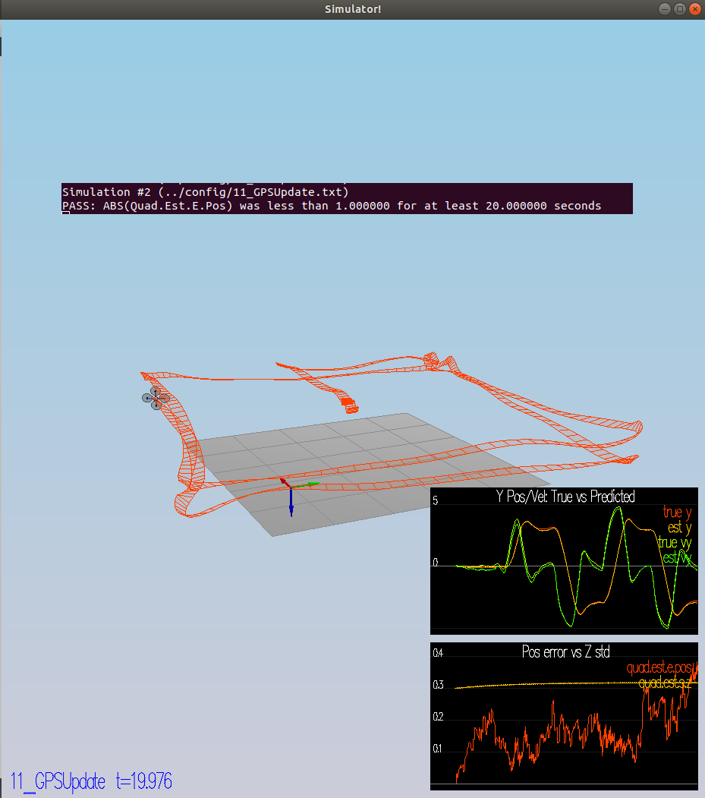

# **Project 4: Estimation Project**

Description of the project can be found here: LINK
For this project, you will need to submit:

 - a completed estimator that meets the performance criteria for each of the steps by submitting:
   - `QuadEstimatorEKF.cpp`
   - `config/QuadEstimatorEKF.txt`

 - a re-tuned controller that, in conjunction with your tuned estimator, is capable of meeting the criteria laid out in Step 6 by submitting:
   - `QuadController.cpp`
   - `config/QuadControlParams.txt`

 - a write up addressing all the points of the rubric
___
## **Task 1:** Provide a Writeup / README that includes all the rubric points and how you addressed each one.  You can submit your writeup as markdown or pdf.  
You're reading it! Below I describe how I addressed each rubric point and where in my code each point is handled.
This file contains the following sections:
1. Task 1: Provide a Writeup / README (done).
2. Task 2: Sensor Noise
3. Task 3: Attitude Estimation
4. Task 4: Prediction Step
5. Task 5: Magnetometer Update
6. Task 6: Closed Loop + GPS Update
7. Task 7: Adding My Controller
8. Acknowledgements

___
## **Task 2:**  Sensor Noise

1. After collecting data in Graph 1.txt and Graph2.txt, I plugged these data in an Excel spreadsheet.
2. Using the standard deviation function in the spreadsheet, I was able to obtain the following values:
    - `MeasuredStdDev_GPSPosXY = 0.718`
    - `MeasuredStdDev_AccelXY = 0.490` 

3. After running the simulator, it is possible to see that my standard deviations are accurately capturing the value of approximately 68% of the respective measurements.



___
## **Task 3:**  Attitude Estimation

Now let's look at the first step to our state estimation: including information from our IMU.  In this step, you will be improving the complementary filter-type attitude filter with a better rate gyro attitude integration scheme.

1. The function `UpdateFromIMU()` contains a complementary filter-type attitude filter.  To reduce the errors in the estimated attitude (Euler Angles), implement a better rate gyro attitude integration scheme.  You should be able to reduce the attitude errors to get within 0.1 rad for each of the Euler angles, as shown in the screenshot below.

```
void QuadEstimatorEKF::UpdateFromIMU(V3F accel, V3F gyro)
{
  //
  Quaternion<float> predictedQt = Quaternion<float>::FromEuler123_RPY(rollEst, pitchEst, ekfState(6));
  
  //
  predictedQt.IntegrateBodyRate(gyro, dtIMU);

  // 
  float predictedPitch = predictedQt.Pitch();
  float predictedRoll = predictedQt.Roll();
  ekfState(6) = predictedQt.Yaw();
  
  // normalize yaw to -pi .. pi
  if (ekfState(6) > F_PI) ekfState(6) -= 2.f*F_PI;
  if (ekfState(6) < -F_PI) ekfState(6) += 2.f*F_PI;


  // CALCULATE UPDATE
  accelRoll = atan2f(accel.y, accel.z);
  accelPitch = atan2f(-accel.x, 9.81f);

  // FUSE INTEGRATION AND UPDATE
  rollEst = attitudeTau / (attitudeTau + dtIMU) * (predictedRoll)+dtIMU / (attitudeTau + dtIMU) * accelRoll;
  pitchEst = attitudeTau / (attitudeTau + dtIMU) * (predictedPitch)+dtIMU / (attitudeTau + dtIMU) * accelPitch;

  lastGyro = gyro;
}
```

2. After running the simulator, it is possible to see that my attitude estimator needs to get within 0.1 rad for each of the Euler angles for at least 3 seconds.


___
## **Task 4:**  Prediction Step

1. The `PredictState()` function. 
```
VectorXf QuadEstimatorEKF::PredictState(VectorXf curState, float dt, V3F accel, V3F gyro)
{
  //
  assert(curState.size() == QUAD_EKF_NUM_STATES);
  VectorXf predictedState = curState;
  
  //
  Quaternion<float> attitude = Quaternion<float>::FromEuler123_RPY(rollEst, pitchEst, curState(6));
 
  //
  V3F accelInertialFrame = attitude.Rotate_BtoI(accel);
 
  //
  predictedState(0) += predictedState(3) * dt;
  predictedState(1) += predictedState(4) * dt;
  predictedState(2) += predictedState(5) * dt;
 
  //
  predictedState(3) += accelInertialFrame.x * dt;
  predictedState(4) += accelInertialFrame.y * dt;
  predictedState(5) += (accelInertialFrame.z - CONST_GRAVITY) * dt;

  return predictedState;
}
```

2. The function `GetRbgPrime()`.  
```
MatrixXf QuadEstimatorEKF::GetRbgPrime(float roll, float pitch, float yaw)
{
  //
  MatrixXf RbgPrime(3, 3);
  RbgPrime.setZero();
  //
  RbgPrime(0, 0) = -cos(pitch) * sin(yaw);
  RbgPrime(0, 1) = -sin(roll) * sin(pitch) * sin(yaw) - cos(roll) * cos(yaw);
  RbgPrime(0, 2) = -cos(roll) * sin(pitch) * sin(yaw) + sin(roll) * cos(yaw);
  //
  RbgPrime(1, 0) = cos(pitch) * cos(yaw);
  RbgPrime(1, 1) = sin(roll) * sin(pitch) * cos(yaw) - cos(roll) * sin(yaw);
  RbgPrime(1, 2) = cos(roll) * sin(pitch) * cos(yaw) + sin(roll) * sin(yaw);

  return RbgPrime;
}
```

The function `Predict()`.
```
void QuadEstimatorEKF::Predict(float dt, V3F accel, V3F gyro)
{
  // predict the state forward
  VectorXf newState = PredictState(ekfState, dt, accel, gyro);

  // we'll want the partial derivative of the Rbg matrix
  MatrixXf RbgPrime = GetRbgPrime(rollEst, pitchEst, ekfState(6));

  // we've created an empty Jacobian for you, currently simply set to identity
  MatrixXf gPrime(QUAD_EKF_NUM_STATES, QUAD_EKF_NUM_STATES);
  gPrime.setIdentity();

  //
  gPrime(0, 3) = dt;
  gPrime(1, 4) = dt;
  gPrime(2, 5) = dt;

  //
  gPrime(3, 6) = (RbgPrime(0, 0) * accel.x + RbgPrime(0, 1) * accel.y + RbgPrime(0, 2) * (accel.z)) * dt;
  gPrime(4, 6) = (RbgPrime(1, 0) * accel.x + RbgPrime(1, 1) * accel.y + RbgPrime(1, 2) * (accel.z)) * dt;
  gPrime(5, 6) = (RbgPrime(2, 0) * accel.x + RbgPrime(2, 1) * accel.y + RbgPrime(2, 2) * (accel.z)) * dt;

  //
  ekfCov = gPrime * ekfCov * gPrime.transpose() + Q;
  
  //
  ekfState = newState;
}
```
___
## **Task 5:** Magnetometer Update

1. The function `UpdateFromMag()`.  
```
void QuadEstimatorEKF::UpdateFromMag(float magYaw)
{
  //
  VectorXf z(1), zFromX(1);
  z(0) = magYaw;

  //
  MatrixXf hPrime(1, QUAD_EKF_NUM_STATES);
  hPrime.setZero();

  // 
  zFromX(0) = ekfState(6); //current estimate
  
  //
  float yawError = z(0) - zFromX(0);
  if (yawError >= M_PI)
  {
      zFromX(0) += 2.f*M_PI;
  }
  else if (yawError <= -M_PI)
  {
      zFromX(0) -= 2.f*M_PI;
  }

  //
  hPrime(6) = 1;

  //
  Update(z, hPrime, R_Mag, zFromX);
}
```

2. Checking the goal. *Your goal is to both have an estimated standard deviation that accurately captures the error and maintain an error of less than 0.1rad in heading for at least 10 seconds of the simulation.*


___
## **Task 6:** Closed Loop + GPS Update

1. The function `UpdateFromGPS()`.
```
void QuadEstimatorEKF::UpdateFromGPS(V3F pos, V3F vel)
{
  //
  VectorXf z(6), zFromX(6);
  z(0) = pos.x;
  z(1) = pos.y;
  z(2) = pos.z;
  z(3) = vel.x;
  z(4) = vel.y;
  z(5) = vel.z;
  
  //
  MatrixXf hPrime(6, QUAD_EKF_NUM_STATES);
  hPrime.setZero();
  
  //
  for (int i=0; i < 6; i++){
      zFromX(i) = ekfState(i);
      hPrime(i, i) = 1;
  };
  
  //
  Update(z, hPrime, R_GPS, zFromX);
}
```
2. Checking the goal. *Your objective is to complete the entire simulation cycle with estimated position error of < 1m.*



___
## **Task 7:** Adding My Controller

1. Replace `QuadController.cpp`  and `QuadControlParams.txt`.

Original Position and Velocity Gains
```
# Position control gains
kpPosXY = 24 
kpPosZ = 60
KiPosZ = 60
# Velocity control gains
kpVelXY = 9
kpVelZ = 25
```



2. Detune the controller.

New Position and Velocity Gains
```
# Position control gains
kpPosXY = 3 
kpPosZ = 12
KiPosZ = 12

# Velocity control gains
kpVelXY = 2
kpVelZ = 6
```



## Acknoledgments ##

Thanks to Fotokite for the initial development of the project code and simulator.
Thanks the Slack community.

